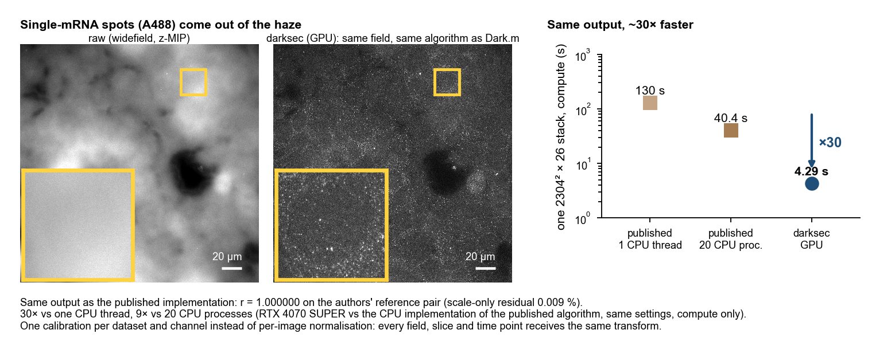

# darksec — Dark sectioning on the GPU with dataset-level calibration

[](https://doi.org/10.5281/zenodo.22782788)



**Same output, ~30× faster.** darksec reproduces the published Dark sectioning implementation (r = 1.000000 on the
authors' reference input/output pair) and processes a 2304² × 26 stack in 4.3 s on an RTX 4070 SUPER, against 130 s for
the published algorithm on one CPU thread (30×) and 40 s on 20 CPU processes (9×). A 16-timepoint × 2-channel live movie
takes 1.9 min instead of about 30 min.

`darksec` runs Dark sectioning (Cao et al., *Nature Methods* 22, 1299–1310, 2025: removal of out-of-focus background with a
dark-channel prior) on the GPU with CuPy, reads Leica THUNDER `.lof` stacks directly, and replaces the published
per-image normalisation by **one calibration per dataset and channel**, so that every field, slice and time point of an
experiment receives the same transform.

## Concept

**The algorithm** is the published one. For every z plane:

1. split the plane into a high- and a low-frequency part (Hi / Lo) with a Gaussian set by the optical resolution
   (`0.5 λ / NA / factor`), and form the low-frequency image EL;
2. dehaze Lo with the dark-channel prior: `A(x) = dep · (EL_norm(x) · (A_max − A_min) + A_min)`,
   `t = 1 − ω · min_filter(Lo / A)` smoothed by a guided filter, `J = (Lo − A) / t + A`;
3. recombine: `result = J / hl + Hi`.

The presets `mild` / `moderate` / `severe` run 1 / 2 / 3 iterations (`moderate` = the published `background = 1`, the
default). `strength` (0–100) is the dark-channel weight `100 ω`; 95 is the published value, 0 leaves the image unchanged.
Further options (`model`, `cutoff`, per-channel overrides) are documented in `config.yaml`.

**What is different: one calibration per dataset.** The published code rescales every stack to its own minimum and
maximum before processing and to its own maximum afterwards, so the threshold and the background estimate refer to a
different absolute intensity in every image, and one hot pixel can compress a whole field. darksec samples a few
planes from every file of a dataset once and fixes, per channel,

| value | how it is set | role |
|---|---|---|
| `lo`, `hi` | median over sampled slices of the per-slice p0.1 / p99.9 (fixed values allowed) | linear map raw counts → 0–255, common to all images |
| atmosphere statistics (`A_min`, `A_max`, `EL_max` per iteration) | median of the per-slice estimates | makes the background law `A(x)` common to all images |
| `thres` | in the 0–255 scale (default 70) | background / signal separation at the same absolute intensity everywhere |

Consequences: all outputs of an experiment share one unit (raw counts above `lo`); a crop processed alone equals the same
region inside the full field; the result does not depend on how many planes a stack has; changing the preset or
`strength` recalibrates automatically. `processing.atmosphere_mode: per_stack | per_slice` restores the adaptive
behaviour when wanted.

**Implementation.** One plane at a time on the GPU (memory ≈ 0.5 GB for 2304² frames, independent of the number of
planes); FFT sizes padded to `scipy.fft.next_fast_len`; filters computed once per image size; float64 throughout; every
FFT size is round-trip tested and falls back to the CPU if the cuFFT library is wrong (see Installation).

## Installation

```bash
conda env create -f environment.yml && conda activate darksec
python -c "from cupy.cuda import cufft; print(cufft.getVersion())"   # must print 10900 or higher
cp paths.env.example paths.env && $EDITOR paths.env                    # where your data live
```

`environment.yml` pins the versions the tool was validated with (Python 3.10, CuPy 13.6 for CUDA 11.x, NVIDIA driver
≥ 525). For CUDA 12 replace `cupy-cuda11x` by `cupy-cuda12x` and `nvidia-cufft-cu11` by `nvidia-cufft-cu12`.

**cuFFT.** The cuFFT of CUDA 11.1 (10.3.0.105) returns wrong, non-deterministic 2-D complex128 transforms for sizes with a
large prime factor. `environment.yml` therefore installs the cuFFT 10.9 wheel; the version check above must not print
10300. darksec also pads to smooth sizes and self-tests every transform size (`python tests/test_cufft_sizes.py`).

**Data roots.** No path is hard-coded. `config.yaml` and the tests read the data locations from environment variables or
from the untracked `paths.env`:

| variable | meaning | default |
|---|---|---|
| `DARKSEC_RAW_ROOT` | folder holding the Leica project folders (`<name>--Project001/...`) | `~/Leica_rawdata` |
| `DARKSEC_DS_ROOT` | output root (`config.yaml: output_root`) | `~/Leica_DS` |

`config.yaml` may use `${DARKSEC_RAW_ROOT}` and `${DARKSEC_DS_ROOT}`.

**Validation.** darksec reproduces the reference implementation's own published input/output pair to r = 1.000000
(scale-only residual < 0.01 %), and agrees with the independent CPU implementation in `darksec/upstream_ref.py` to the
same precision on the example field in `data/`. `tests/test_upstream_reference.py` performs the first comparison if you
have the reference repository locally (at `upstream/Dark-sectioning`); `bash tests/run_all.sh` runs everything that
needs no external data.

## Usage

```bash
python run_ds.py index                    # list the image files and channels (no processing)
python run_ds.py calibrate                # write calibration.json per dataset
python run_ds.py run                      # calibrate if needed -> process every file -> ds_log.csv
python run_ds.py run --files "A/2" --limit 2                      # a subset
python run_ds.py run --datasets ${DARKSEC_RAW_ROOT}/MyExperiment--Project001
python run_ds.py run --mode per_stack --overwrite                 # another atmosphere mode
python run_ds.py qc                       # QC figures (figs/<dataset>/)
```

All parameters live in `config.yaml`. List the Leica project folders under `datasets:`; an entry of the form
`{path: <folder>, include: ["TileScan 9/"]}` restricts calibration and processing to the files whose relative path
contains one of the substrings. Image `.lof` files are found automatically in the layouts `TileScan N/<row>/<col>/P<n>.lof`,
`Image N.lof` and `P 1.lof`; `Pyramid/`, `Additional Data/` and `*_ICC.lof` are skipped. Channels are identified from the
`.xlif` sidecar (LED lines `635nm`, `470nm`, `400nm`, `542nm`, `588nm`, `740nm`); bright-field channels are excluded.
TIFF stacks can be used as input as well (`{path, type: tiff, pixel_nm, NA, channels}`).

### Output

`<output_root>/<dataset>/<relative path>_DS.tif`

| file | content |
|---|---|
| `*_DS.tif` | ImageJ hyperstack `TZCYX`, uint16, processed fluorescence channels only; OME-BigTIFF above 4 GB |
| `*_DS_MIP.tif` | z maximum projection, `TCYX` |
| `*_DS.json` | calibration values, parameters, channel mapping and per-stack statistics used for this image |
| `calibration.json` | calibration per dataset × channel; reusable for another experiment with `calibration.from_file` |
| `calibration_slices.csv` | per-slice statistics of the calibration sample |
| `ds_log.csv` | input/output statistics and timing of every (file, channel, time point) |

Output values are raw counts above the calibration floor `lo` (`counts = u × (hi − lo) / 255`). Images processed with the
same `calibration.json` share one unit. uint16 output clips negative values to 0 (`output.dtype: float32` keeps them).

## Example data

`data/` holds one field of the banner above so that the installation can be verified end to end (widefield z-stack,
21 planes × 0.40 µm, 103.6 nm pixels, 63x/1.40 oil, single-mRNA FISH spots, A488):

| file | content |
|---|---|
| `A488_raw_1024x1024x21.tif` | raw stack, 1024² crop of the 2304² field (OME-TIFF, zlib) |
| `A488_darksec_1024x1024x21.tif` | the same region of the darksec output computed on the **full** field |
| `A488_calibration.json` | the dataset calibration used for that output |
| `A488_raw_MIP_2304x2304.tif`, `A488_darksec_MIP_2304x2304.tif` | z maximum projections of the full field (the banner images) |

```bash
python tests/verify_example_data.py
```

processes the crop alone through `run_ds.py` (TIFF input, `calibration.from_file`) and compares it with the shipped
output of the full field: because the calibration is fixed per dataset, the two agree in the interior (p99.9 of the
difference < 0.01 %, r = 1.000000; only a 64 px border differs through the padding). The same run by hand:

```yaml
datasets:
  - {path: data/A488_raw_1024x1024x21.tif, type: tiff, name: example, pixel_nm: 103.554, NA: 1.40, z_step_um: 0.3995, channels: ["470nm"]}
calibration:
  from_file: data/A488_calibration.json
```

## Speed

Same algorithm, inputs and settings (2 iterations, `thres` 70, no denoise), compute only (`tests/benchmark_speed.py`):

| implementation | 512² × 21 (crop of the example field) | 2304² × 26 |
|---|---|---|
| published algorithm (CPU implementation `darksec/upstream_ref.py`), 1 thread | 3.0 s | 130 s |
| published algorithm, 20 processes × 1 thread | 1.2 s | 40 s |
| darksec, GPU (RTX 4070 SUPER) | 0.23 s | **4.3 s** |

Both sides use the same separable minimum filter, so the ratio is the GPU, not an algorithmic shortcut. End to end
(`.lof` reading to TIFF writing) the 2304² × 26 stack takes 5.8 s. The 2304² case needs a Leica dataset and is skipped
by the benchmark when none is configured.

## Repository

| path | content |
|---|---|
| `run_ds.py`, `config.yaml` | command-line tool and its single configuration file |
| `darksec/core.py` | GPU algorithm (`DarkSectioner`, filters, atmosphere statistics, cuFFT self-test) |
| `darksec/leica.py`, `darksec/tiffio.py` | `.lof` / `.xlif` reading, TIFF input |
| `darksec/calibrate.py`, `darksec/pipeline.py`, `darksec/batch.py` | calibration, per-file processing, batch runs and logs |
| `darksec/upstream_ref.py` | independent NumPy implementation of the published algorithm (CPU reference) |
| `darksec/deconv.py` | Richardson–Lucy deconvolution (reference implementation used by the tests) |
| `darksec/paths.py`, `paths.env.example` | data roots |
| `tests/` | reference-pair validation, cuFFT check, crop invariance, `strength` and option checks, transfer function, benchmark, example-data check |
| `data/` | example field: raw crop, darksec output, calibration, full-field projections |

Licence: Apache-2.0 (`LICENSE`). The example images in `data/` are released under CC BY 4.0. Third-party attributions
are in `NOTICE`.

## Acknowledgements

darksec implements the Dark sectioning algorithm of Cao, R. et al., "Dark-based optical sectioning assists background
removal in fluorescence microscopy", *Nature Methods* 22, 1299–1310 (2025), whose reference implementation is published at
[github.com/Cao-ruijie/Dark-sectioning](https://github.com/Cao-ruijie/Dark-sectioning) (see `NOTICE` for its licence statement). Please cite
that paper when you use this tool.

## Citation

If you use darksec, please cite the Dark sectioning paper and this software:

> Cao, R. et al. Dark-based optical sectioning assists background removal in
> fluorescence microscopy. *Nature Methods* **22**, 1299-1310 (2025).
> https://doi.org/10.1038/s41592-025-02667-6

> Ohishi, H. darksec: Dark sectioning on the GPU with dataset-level calibration.
> Zenodo (2026). https://doi.org/10.5281/zenodo.22782788

## Contact

If you have any questions or need support, please contact Hiroaki Ohishi (Dokkyo Medical University) at
[h-oishi788@dokkyomed.ac.jp](mailto:h-oishi788@dokkyomed.ac.jp).
